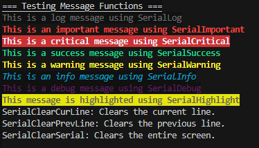
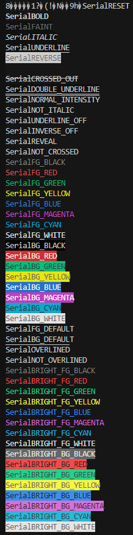

# SerialANSI
SerialANSI is an easy-to-use Arduino library for styling text output in the Serial Monitor using ANSI escape codes. It helps you format your logs, important messages, warnings, and more with colors, bold text, underlines, and other styles directly in your serial output. The library also provides functions to manipulate the Serial Monitor, like clearing lines or resetting colors.

> [!important]
> This library doesn't work in the arduino ide serial monitor as it doesn't support ANSI codes, furthermore the library has only been tested in the VSCode/Platform IO environment (but it should work fine in any terminal that supports ANSI).

## Features
- Predefined Text Styles: Easily log messages with predefined formats such as ```SerialLog```, ```SerialImportant```, ```SerialWarning```, ```SerialSuccess```, and more.
- Clear Lines and Screen: Functions to clear the current or previous lines or even clear the entire Serial Monitor screen.
- Full ANSI Code Support: Change text styles, set foreground and background colors, and apply various text effects like bold, faint, underline, and overline.

## Installation
- Download the repository as a .zip or clone it to your local machine.
- Either put the ```SerialANSI.h``` file in your working directory or in the arduino IDE go to ```sketch/include Library/add .ZIP Library``` (this will put the folder in the default arduino library folder which for me is ```C:\Users\xxxxxx\Documents\Arduino\libraries``` so you can also do it manually).
- Add #include <SerialANSI.h> to your Arduino sketch.
- Start styling your Serial Monitor output with ease!

## Usage
The message functions works just like ```Serial.println```
```ino
  SerialTitle("=== Testing Message Functions ===");

  SerialLog("This is a log message using SerialLog");
  SerialImportant("This is an important message using SerialImportant");
  SerialCritical("This is a critical message using SerialCritical");
  SerialSuccess("This is a success message using SerialSuccess");
  SerialWarning("This is a warning message using SerialWarning");
  SerialInfo("This is an info message using SerialInfo");
  SerialDebug("This is a debug message using SerialDebug");
  SerialHighlight("This message is highlighted using SerialHighlight");
```


| Function            | Description                                                              |
|---------------------|--------------------------------------------------------------------------|
| SerialLog()         | Outputs a faint log message                                               |
| SerialImportant()    | Outputs a bold, red message indicating importance                        |
| SerialCritical()     | Outputs a bold, red background message indicating a critical event       |
| SerialSuccess()      | Outputs a bold, green message indicating success                         |
| SerialWarning()      | Outputs a bold, yellow warning message                                   |
| SerialInfo()         | Outputs a cyan italicized informational message                          |
| SerialDebug()        | Outputs a faint magenta message for debugging                            |
| SerialHighlight()    | Highlights the message with a yellow background and bold text            |

The following utility functions can be called without any arguments and are useful for resetting the output or clearing lines in the Serial Monitor.

```c++
SerialReset();
SerialClearCurLine();
SerialClearPrevLine();
SerialClearSerial();
```

| Function            | Description                                                              |
|---------------------|--------------------------------------------------------------------------|
| SerialReset()        | Resets text styling (only useful when using the variables)               |
| SerialClearCurLine() | Clears the current line                                                  |
| SerialClearPrevLine()| Clears the previous line                                                 |
| SerialClearSerial()  | Clears the entire Serial Monitor screen                                  |

## ANSI Code Support
This library supports a wide range of ANSI escape codes to style your text output. These include foreground and background colors, text effects (bold, faint, italic), and the ability to reset the styles back to default.

These are actually just variable with the corresponding ANSI code so to use them you put them in a Serial.print():
```ino
Serial.print(SerialCROSSED_OUT);
Serial.print("crossed out text");
SerialReset();
```
Here is a list of all variables :



the list follow the table in the wikipedia page for ANSI code minus the ones that don't work in the VSCode/platform io serial monitor terminal.
